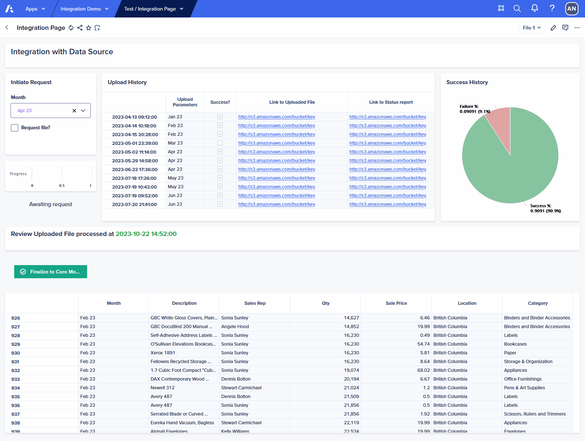

<p align="center">
	
</p>  
<p align="center">
  <a href="https://www.mit.edu/~amini/LICENSE.md"></a>
  <a href="https://github.com/EliteEPM/EasySync/releases"></a>
  
</p>  

# EasySync - Alternative to Anaplan Connect
A seamless way to interact with the Anaplan platform through its APIs, enabling you to easily control and manage integrations from within an Anaplan NUX page. Use this as a replacement for Anaplan Connect. Automate data transfers, extract and store error logs, or perform other operations within Anaplan, this library simplifies integrations into Anaplan

Visit the wiki for full setup guide!

## Features

- File Push completely controlled via Anaplan NUX Page and intended for end users

- Gives users a sense of satisfaction as they can control key files directly. This is very commonly requested by customers

- Gives visibility to model builder team via Status Report and the Uploaded file

- Easily understandable Python Code

- This library uses dotenv to make environment accessible and maintainable

- Easy to deploy with minimum involvement of customer IT team

## Requirements
- VM required (basic config sufficient, at least 4GB of memory, preferable linux)

- Python3 installed, knowledge of Python functions and classes. Basic knowledge on usage of terminal

- Basic knowledge of Process IDs, File IDs, other metadata in Anaplan

- Assumes that source system (such as SAP, Netsuite, Database) also provide APIs consumable by Python

- Advanced feature will upload status report as well as the file uploaded into an S3 bucket, will take additional effort to configure


## Usage

#### Create the login class using username and password
```python    
from anaplan import AnaplanAuth

un = os.environ.get('un')
pw = os.environ.get('pw')

login = AnaplanAuth('basic', f'{un}:{pw}')
```

#### Create Model connection and run a Process
```python
from anaplan import AnaplanModel
ws_id = ''
model_id = ''
conn = AnaplanModel(login, ws_id, model_id)
conn.run('118000000000')
```

#### Get all model specific IDs
```python
from pprint import pprint
from anaplan import AnaplanModel

conn = AnaplanModel(login, ws_id, model_id)

print("============Processes============")
pprint(conn.processes)
print("============Views============")
pprint(conn.views)
print("============Line Items============")
pprint(conn.line_items)
print("============Files============")
pprint(conn.files)
```

#### Get Module saved view as Json Object
```python
from anaplan import AnaplanModel

conn = AnaplanModel(login, ws_id, model_id)
conn.view('222000000000')
```    
#### Upload File
```python
from anaplan import AnaplanModel

conn = AnaplanModel(login, ws_id, model_id)
conn.upload('113000000000', 'filename.csv')
```

#### Demo of full run


## Maintenance

This library is actively maintained to ensure compatibility with the latest Anaplan API changes and improvements. If you encounter any issues, have feature requests, or would like to contribute, please open an issue or pull request on this repository. We appreciate your feedback and support in making this library even better.

Note: Ensure that you keep your API credentials and sensitive information secure. It's recommended to use environment variables or a secure configuration method to store your credentials.
